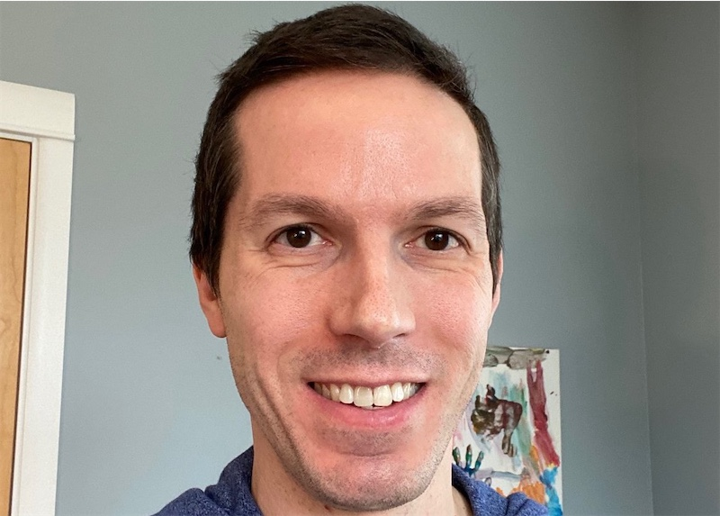

El desarrollo de React está dirigido por un pequeño equipo dedicado a tiempo completo en Meta. También recibe contribuciones de personas alrededor del mundo.

## Conoce al equipo de React {#meet-the-react-team}

Los miembros del equipo de React trabajan a tiempo completo en las APIs de los componentes del núcleo, el motor que hace funcionar a React DOM y React Native, React DevTools y el sitio de la documentación de React.

Los miembros actuales del equipo de React se listan debajo en orden alfabético.

### Andrew Clark {#andrew-clark}

[@acdlite en GitHub](https://github.com/acdlite) &middot; [@acdlite en Twitter](https://twitter.com/acdlite)

Andrew se inició en el desarrollo web haciendo sitios con WordPress y eventualmente consiguió convencerse en comenzar a escribir JavaScript. Su pasatiempo favorito es el karaoke. Andrew es o bien un villano de Disney o bien una princesa de Disney, en dependencia del día.

### Dan Abramov {#dan-abramov}

[@gaearon en GitHub](https://github.com/gaearon) &middot; [@dan_abramov en Twitter](https://twitter.com/dan_abramov)

Dan entró a la programación después de descubrir accidentalmente Visual Basic dentro de Microsoft PowerPoint. Ha encontrado su verdadera vocación en convertir los tuits de [Sebastian](#sebastian-markbage) en grandes publicaciones de blog. En ocasiones gana en Fortnite escondiéndose en un arbusto hasta que se acabe el juego.

### Jason Bonta {#jason-bonta}

Jason likes having large volumes of Amazon packages delivered to the office so that he can build forts. Despite literally walling himself off from his team at times and not understanding how for-of loops work, we appreciate him for the unique qualities he brings to his work. 

### Joe Savona {#joe-savona}

[@josephsavona on GitHub](https://github.com/josephsavona) &middot; [@en_JS on Twitter](https://twitter.com/en_JS)

Joe was planning to major in math and philosophy but got into computer science after writing physics simulations in Matlab. Prior to React, he worked on Relay, RSocket.js, and the Skip programming language. While he’s not building some sort of reactive system he enjoys running, studying Japanese, and spending time with his family.

### Josh Story {#josh-story}

[@gnoff on GitHub](https://github.com/gnoff) &middot; [@joshcstory on Twitter](https://twitter.com/joshcstory)

Josh majored in Mathematics and discovered programming while in college. His first professional developer job was to program insurance rate calculations in Microsoft Excel, the paragon of Reactive Programming which must be why he now works on React. In between that time Josh has been an IC, Manager, and Executive at a few startups. outside of work he likes to push his limits with cooking.

### Lauren Tan {#lauren-tan}

[@poteto on GitHub](https://github.com/poteto) &middot; [@potetotes on Twitter](https://twitter.com/potetotes)

Lauren’s programming career peaked when she first discovered the `<marquee>` tag. She’s been chasing that high ever since. When she’s not adding bugs into React, she enjoys dropping cheeky memes in chat, and playing all too many video games with her partner and dog Zelda.

### Luna Ruan {#luna-ruan}

[@lunaruan en GitHub](https://github.com/lunaruan) &middot; [@lunaruan en Twitter](https://twitter.com/lunaruan)

Luna aprendió a programar, porque pensó que significaba crear videojuegos. En cambio, terminó trabajando en la aplicación web de Pinterest y ahora en el mismo React. Luna ya no quiere hacer videojuegos, pero planea hacer escritura creativa si alguna vez se aburre.

### Mofei Zhang {#mofei-zhang}

[@mofeiZ on GitHub](https://github.com/mofeiZ)]

Mofei comenzó a programar cuando se dio cuenta de que podía ayudarla a hacer trampa en los juegos de video. Se enfocó en sistemas operativos en pre y posgrado, pero ahora se haya feliz experimentando con React. Fuera del trabajo, disfruta solucionar problemas de búlder y planear su próximo viaje(s) de mochilera.

### Rick Hanlon {#rick-hanlon}

[@rickhanlonii on GitHub](https://github.com/rickhanlonii) &middot; [@rickhanlonii en Twitter](https://twitter.com/rickhanlonii)

Ricky se especializó en matemática teórica y de alguna forma terminó en el equipo de React Native por un par de años hasta unirse al equipo de React. Cuando no está programando lo puedes encontrar practicando snowboard, ciclismo, escalada, golf o cerrando *issues* en GitHub que no se ajustan a la plantilla.

### Samuel Susla {#samuel-susla}

[@sammy-SC on GitHub](https://github.com/sammy-SC) &middot; [@SamuelSusla on Twitter](https://twitter.com/SamuelSusla)

Samuel’s interest in programming started with the movie Matrix. He still has Matrix screen saver. Before working on React, he was focused on writing iOS apps. Outside of work, Samuel enjoys playing beach volleyball, squash, badminton and spending time with his family.

### Sathya Gunasekaran {#sathya-gunasekaran}

[@gsathya on GitHub](https://github.com/gsathya) &middot; [@_gsathya on Twitter](https://twitter.com/_gsathya)

Sathya hated the Dragon Book in school but somehow ended up working on compilers all his career. When he's not compiling React components, he's either drinking coffee or eating yet another Dosa.

### Sebastian Markbåge {#sebastian-markbage}

[@sebmarkbage en GitHub](https://github.com/sebmarkbage) &middot; [@sebmarkbage en Twitter](https://twitter.com/sebmarkbage)

Sebastian se especializó en psicología. A menudo es callado. Aún cuando dice algo, con frecuencia no tiene sentido para el resto de nosotros hasta algunos meses después. La forma correcta de pronunciar su apellido es "mark-bo-gue", pero se ha conformado con "mark-beish" por pragmatismo, y así mismo es su enfoque en React.

### Sebastian Silbermann {#sebastian-silbermann}

[@eps1lon on GitHub](https://github.com/eps1lon) &middot; [@sebsilbermann on Twitter](https://twitter.com/sebsilbermann)

Sebastian learned programming to make the browser games he played during class more enjoyable. Eventually this lead to contributing to as much open source code as possible. Outside of coding he's busy making sure people don't confuse him with the other Sebastians and Zilberman of the React community.

### Seth Webster {#seth-webster}

[@sethwebster en GitHub](https://github.com/sethwebster) &middot; [@sethwebster en Twitter](https://twitter.com/sethwebster)

Seth comenzó a programar cuando era un niño en Tucson, Arizona. Luego de la escuela, le picó el bichito de la música y por 10 años fue un músico de gira antes de retornar a *trabajar*, comenzando con Intuit. En su tiempo libre, le encanta [tomar fotos](https://www.sethwebster.com) y volar para rescatar animales en el noreste de los Estados Unidos.

### Sophie Alpert {#sophie-alpert}

[@sophiebits on GitHub](https://github.com/sophiebits) &middot; [@sophiebits on Twitter](https://twitter.com/sophiebits)

Four days after React was released, Sophie rewrote the entirety of her then-current project to use it, which she now realizes was perhaps a bit reckless. After she became the project's #1 committer, she wondered why she wasn't getting paid by Facebook like everyone else was and joined the team officially to lead React through its adolescent years. Though she quit that job years ago, somehow she's still in the team's group chats and “providing value”.

### Tianyu Yao {#tianyu-yao}

[@tyao1 on GitHub](https://github.com/tyao1) &middot; [@tianyu0 on Twitter](https://twitter.com/tianyu0)

Tianyu’s interest in computers started as a kid because he loves video games. So he majored in computer science and still plays childish games like League of Legends. When he is not in front of a computer, he enjoys playing with his two kittens, hiking and kayaking.

### Yuzhi Zheng {#yuzhi-zheng}

[@yuzhi on GitHub](https://github.com/yuzhi) &middot; [@yuzhiz on Twitter](https://twitter.com/yuzhiz)

Yuzhi studied Computer Science in school. She liked the instant gratification of seeing code come to life without having to physically be in a laboratory. Now she’s a manager in the React org. Before management, she used to work on the Relay data fetching framework. In her spare time, Yuzhi enjoys optimizing her life via gardening and home improvement projects.

## Agradecimientos {#acknowledgements}

React fue creado originalmente por [Jordan Walke](https://github.com/jordwalke). Hoy, React tiene más de mil contribuidores de código abierto. Nos gustaría reconocer a algunas personas que han hecho contribuciones significativas a React y su documentación en el pasado y que han ayudado a su mantenimiento a lo largo de los años:

* [Almero Steyn](https://github.com/AlmeroSteyn)
* [Andreas Svensson](https://github.com/syranide)
* [Alex Krolick](https://github.com/alexkrolick)
* [Alexey Pyltsyn](https://github.com/lex111)
* [Brandon Dail](https://github.com/aweary)
* [Brian Vaughn](https://github.com/bvaughn)
* [Caleb Meredith](https://github.com/calebmer)
* [Chang Yan](https://github.com/cyan33)
* [Cheng Lou](https://github.com/chenglou)
* [Christoph Nakazawa](https://github.com/cpojer)
* [Christopher Chedeau](https://github.com/vjeux)
* [Clement Hoang](https://github.com/clemmy)
* [Dominic Gannaway](https://github.com/trueadm)
* [Flarnie Marchan](https://github.com/flarnie)
* [Jason Quense](https://github.com/jquense)
* [Jesse Beach](https://github.com/jessebeach)
* [Jessica Franco](https://github.com/Jessidhia)
* [Jim Sproch](https://github.com/jimfb)
* [Josh Duck](https://github.com/joshduck)
* [Joe Critchley](https://github.com/joecritch)
* [Jeff Morrison](https://github.com/jeffmo)
* [Keyan Zhang](https://github.com/keyz)
* [Marco Salazar](https://github.com/salazarm)
* [Nat Alison](https://github.com/tesseralis)
* [Nathan Hunzaker](https://github.com/nhunzaker)
* [Nicolas Gallagher](https://github.com/necolas)
* [Paul O'Shannessy](https://github.com/zpao)
* [Pete Hunt](https://github.com/petehunt)
* [Philipp Spiess](https://github.com/philipp-spiess)
* [Rachel Nabors](https://github.com/rachelnabors)
* [Robert Zhang](https://github.com/robertzhidealx)
* [Sander Spies](https://github.com/sanderspies)
* [Sasha Aickin](https://github.com/aickin)
* [Sophia Shoemaker](https://github.com/mrscobbler)
* [Sunil Pai](https://github.com/threepointone)
* [Tim Yung](https://github.com/yungsters)
* [Xuan Huang](https://github.com/huxpro)

Esta lista no es exhaustiva.

Nos gustaría agradecer especialmente a [Tom Occhino](https://github.com/tomocchino) y [Adam Wolff](https://github.com/wolffiex) por su guía y apoyo a lo largo de los años. También nos gustaría agradecer a todos los voluntarios que [tradujeron React a otros idiomas](https://translations.reactjs.org/).
